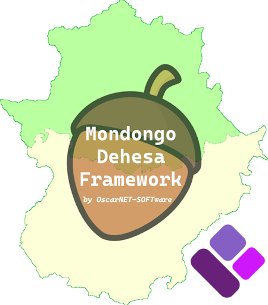

[Read this `README` in **English**](./README.md)

# Mondongo.Dehesa.Framework
Solo un conjunto de bibliotecas esenciales para DotNET: limpio, sencillo y listo para usar.

[](https://www.nuget.org/packages/Mondongo.Dehesa.Framework/)
[](https://github.com/OscarNET-SOFTware/Mondongo.Dehesa.Framework/blob/master/LICENSE.md)



## Descripción general
Este marco de trabajo nace con el objetivo de ofrecer un conjunto organizado, modular y reutilizable de bibliotecas .NET para el desarrollo de aplicaciones modernas, tanto en el ámbito *front end* como *back end*, así como módulos compartidos y utilidades transversales. El ecosistema está diseñado para facilitar la estructuración de proyectos, promover buenas prácticas y aportar un toque de identidad y originalidad a través de su convención de nombres.

El nombre elegido para el marco de trabajo y sus bibliotecas no es casual: responde a un homenaje personal a mis raíces y vínculos familiares con [Extremadura](https://es.wikipedia.org/wiki/Extremadura). Aunque yo no nací allí, mis padres son originarios de esta tierra, y desde siempre Extremadura —*y en especial [Solana de los Barros](https://es.wikipedia.org/wiki/Solana_de_los_Barros), en la comarca de [Tierra de Barros](https://es.wikipedia.org/wiki/Tierra_de_Barros)*— ha sido mi lugar habitual de vacaciones, de reencuentro familiar y de conexión con la cultura, la naturaleza y las tradiciones extremeñas.

Por ello, este marco de trabajo pretende ser también un pequeño tributo a esa tierra que forma parte de mi historia y a la que guardo un cariño especial.

## Sobre el uso de "Mangurrino", "Bellotero" y la convención de nombres en este proyecto
En este proyecto he optado por utilizar los términos "Mangurrino" [(*escuchar pronunciación*)](./assets/audios/spanish-pronunciation-of-mangurrino.mp3) y "Bellotero" [(*escuchar pronunciación*)](./assets/audios/spanish-pronunciation-of-bellotero.mp3) como parte de la convención de nombres de las bibliotecas .NET, dotando así a la solución de una identidad única, local y divertida.

> **IMPORTANTE**
>
> *Ambos términos se emplean aquí **sin ninguna intención peyorativa ni insultante**. Al contrario, buscan rendir homenaje a la riqueza cultural y lingüística de Extremadura, aportando un toque de humor y orgullo local al proyecto.*
> *A continuación, quiero aclarar el origen y el sentido de estos términos, así como el motivo de su aplicación en la arquitectura del código.*

### ¿Por qué "Mangurrino" y "Bellotero"?
* "Mangurrino" es un término coloquial tradicionalmente asociado a los habitantes de la provincia de [Cáceres](https://es.wikipedia.org/wiki/Provincia_de_C%C3%A1ceres). Su origen es popular y, aunque puede tener diferentes acepciones según el contexto, suele referirse de manera simpática a alguien sencillo, campechano, ingenioso o con cierto aire pícaro. En la cultura extremeña, "mangurrino" nunca se utiliza como insulto, sino como apodo cariñoso o costumbrista.

* "Bellotero" se utiliza para referirse a los habitantes de la provincia de [Badajoz](https://es.wikipedia.org/wiki/Provincia_de_Badajoz), en alusión a la bellota, fruto emblemático de la [dehesa](https://es.wikipedia.org/wiki/Dehesa) [(*escuchar pronunciación*)](./assets/audios/spanish-pronunciation-of-dehesa.mp3) extremeña y símbolo de la región. Llamar "bellotero" a alguien de Badajoz es una forma simpática y popular de destacar su procedencia y conexión con la tierra.

### La analogía de la bellota y la geografía de Extremadura
De manera simpática, en algunas zonas de Extremadura se llama "mangurrino" a la parte superior de la bellota (el casquete o "sombrero" que la cubre), mientras que la parte inferior, el fruto en sí, se asocia con la bellota propiamente dicha. Esta analogía se traslada a la geografía de Extremadura:

* Cáceres se encuentra en la parte norte de la región, como la parte de arriba de la bellota (caperuza o mangurria), de ahí el término "Mangurrino".

* Badajoz está en el sur, como la parte de abajo de la bellota (fruto o bellota), de ahí el término "Bellotero".

Así, la convención de nombres no solo refleja la identidad popular, sino también la geografía y el ingenio extremeño.

### ¿Por qué se aplican a *front end* y *back end*?
* He decidido asociar `Mondongo.Mangurrino` a las bibliotecas orientadas al *front end* (interfaz de usuario, presentación, componentes visuales, etc.), evocando el carácter visible y cercano de la parte superior de la bellota y del norte de Extremadura (Cáceres).

* Por otro lado, `Mondongo.Bellotero` identifica las bibliotecas del *back end* (lógica de negocio, acceso a datos, servicios, etc.), simbolizando la robustez, profundidad y arraigo de la parte inferior de la bellota y del sur de Extremadura (Badajoz).

Esta convención facilita la identificación rápida del propósito de cada módulo y refuerza la identidad extremeña en toda la arquitectura.

### ¿Por qué "Mondongo" y los nombres del marco de trabajo y módulos compartidos?
* `Mondongo` [(*escuchar pronunciación*)](./assets/audios/spanish-pronunciation-of-mondongo.mp3) es un guiño a la gastronomía extremeña, especialmente a la tradición de la [matanza](https://es.wikipedia.org/wiki/Matanza_del_cerdo) y a la [morcilla de mondongo](https://es.wikipedia.org/wiki/Morcilla), productos muy presentes en la cultura local. El término se utiliza aquí como nexo común y divertido para todo el ecosistema de bibliotecas.

* Para los módulos de propósito compartido, común o transversal (utilidades, contratos, modelos, helpers, etc.), se ha optado por el término `Mondongo.Iberico`, haciendo referencia al carácter integrador y a la herencia ibérica/extremeña de la solución.

* El nombre global del marco de trabajo, `Mondongo.Dehesa.Framework`, rinde homenaje al ecosistema natural más representativo de Extremadura: la dehesa. Así, se refuerza la idea de un conjunto de herramientas robustas, diversas y profundamente enraizadas en la identidad local.

> **EN RESUMEN**
>
> *Esta convención de nombres no solo organiza y clarifica la arquitectura del código, sino que también celebra la diversidad, el humor y el orgullo de ser extremeño, haciendo de este proyecto algo único y memorable.*

## Empezando
### Prerrequisitos
- .NET 8.0 o posterior.

### Instalación
Próximamente en [NuGet](https://www.nuget.org/profiles/OscarNET):

```shell
dotnet add package Mondongo.Dehesa.Framework
```

o

```powershell
PM> Install-Package Mondongo.Dehesa.Framework
```

## Uso
*Proporcionar aquí ejemplos de código e instrucciones básicas de uso.*

## Documentación
- [CHANGELOG](./CHANGELOG.md)

## Licencia
Este proyecto está licenciado bajo la Licencia MIT. Consulta el archivo [LICENSE](./LICENSE.md) para obtener más información.

En este proyecto se utilizan componentes de terceros. Para consultar la licencia completa, consulta la carpeta [licenses](./licenses) y el archivo [THIRD-PARTY-NOTICES](./THIRD-PARTY-NOTICES.md).